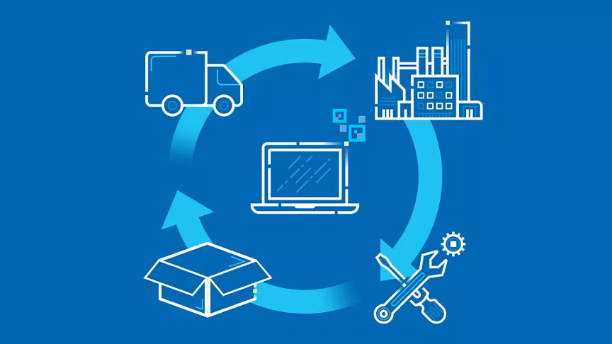

## :checkered_flag: Estrategias de Sostenibilidad en TI

La tecnología avanza a pasos agigantados, pero su impacto ambiental nos obliga a replantear cómo hacemos las cosas. La buena noticia es que el sector TI está adoptando estrategias sostenibles para reducir su huella ecológica y ser más eficiente.

### 🔋 **Uso de Energías Renovables**  
Uno de los mayores problemas de la tecnología es su alto consumo energético, en especial los **centros de datos**. Para reducir el impacto, muchas empresas están migrando a **fuentes de energía renovable** como la solar, eólica e hidroeléctrica. Empresas como Google, Microsoft y Amazon ya operan con **energía 100% renovable** en varios de sus centros de datos.

### 🖥️ **Diseño de Hardware Sostenible**  
Los dispositivos electrónicos generan toneladas de residuos. Para combatir esto, hay dos enfoques clave:  
- **Uso de materiales reciclados y reciclables** en la fabricación de equipos. Por ejemplo, algunas laptops ya incluyen carcasas de aluminio reciclado.  
- **Extender la vida útil de los dispositivos**, eliminando la **obsolescencia programada** y facilitando la **reparación y actualización** de los equipos.

### ☁️ **Optimización de la Computación en la Nube**  
La nube no es solo un espacio de almacenamiento, sino un recurso compartido que **reduce el desperdicio energético** al consolidar la infraestructura de TI. Estrategias como la **virtualización** y el uso de servidores más eficientes permiten disminuir el consumo eléctrico y la huella de carbono.

### 🔄 **Economía Circular en TI**  
En lugar de producir y desechar, la **economía circular** busca reutilizar y reciclar componentes electrónicos. Esto incluye:  
- **Reciclaje de hardware**, reutilizando piezas en lugar de desecharlas.  
- **Reparación y reacondicionamiento** de dispositivos para alargar su vida útil.  
- **Programas de recompra** y reutilización de equipos viejos.

### 💡 **Software Eficiente y Código Verde**  
El software también influye en la sostenibilidad. Un código bien optimizado **consume menos recursos computacionales**, reduciendo el gasto energético. Conceptos como el **Green Coding** y la **optimización del procesamiento de datos** ayudan a minimizar el impacto ambiental de las aplicaciones.

### 🚛 **Logística y Transporte Sostenible**  
Desde el transporte de equipos hasta la distribución de productos, las empresas están adoptando medidas como:  
- **Optimización de rutas para reducir emisiones de CO₂**.  
- **Uso de embalajes ecológicos y biodegradables**.  
- **Fomento del trabajo remoto** para reducir los desplazamientos diarios.

### 🌍 **Virtualización y Reducción del Impacto Ambiental**
- La virtualización permite ejecutar múltiples sistemas en menos servidores, reduciendo el consumo energético y la generación de residuos electrónicos.
